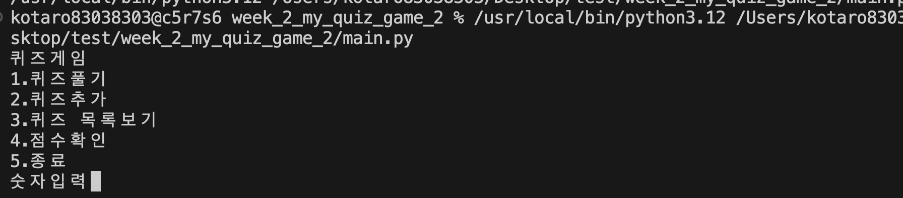
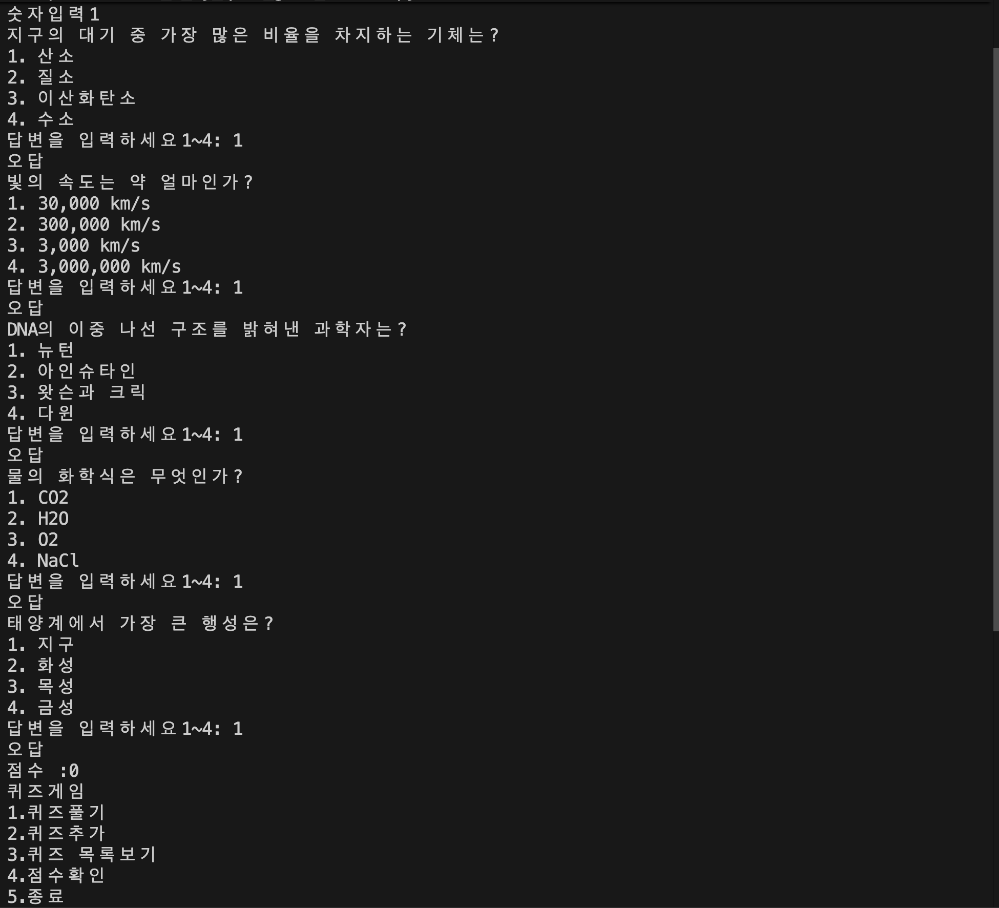
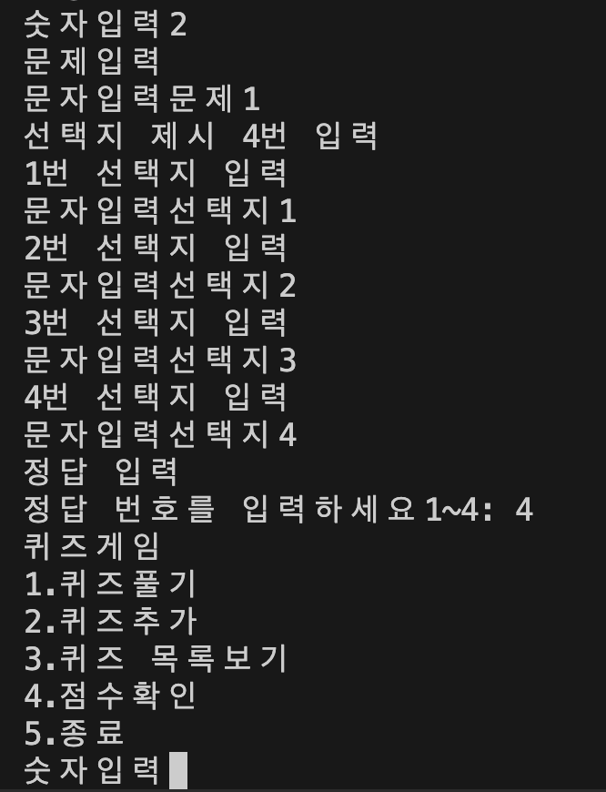
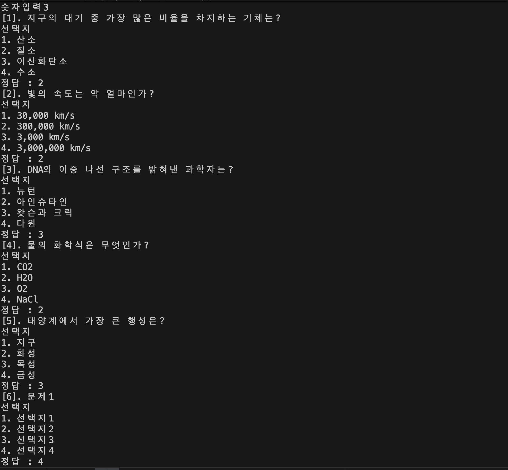
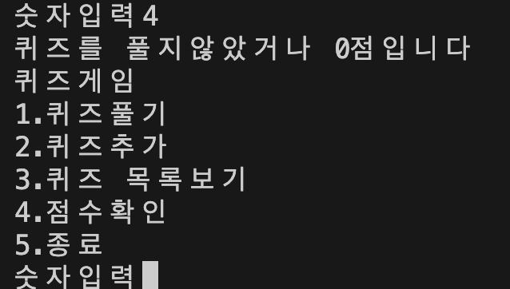
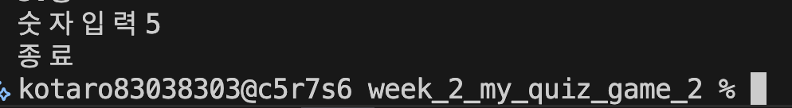
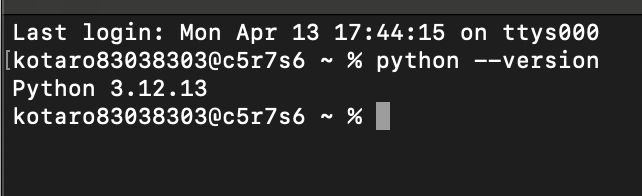
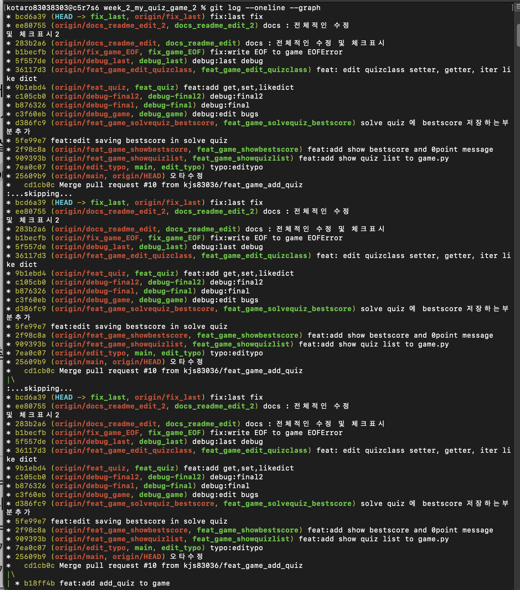
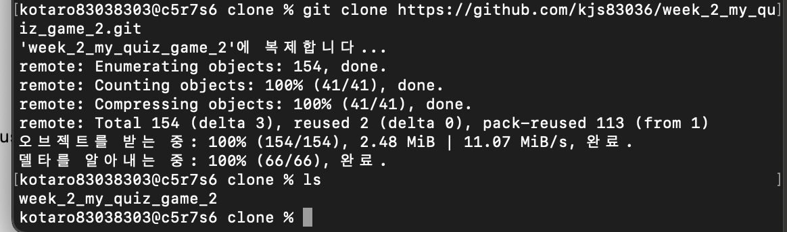
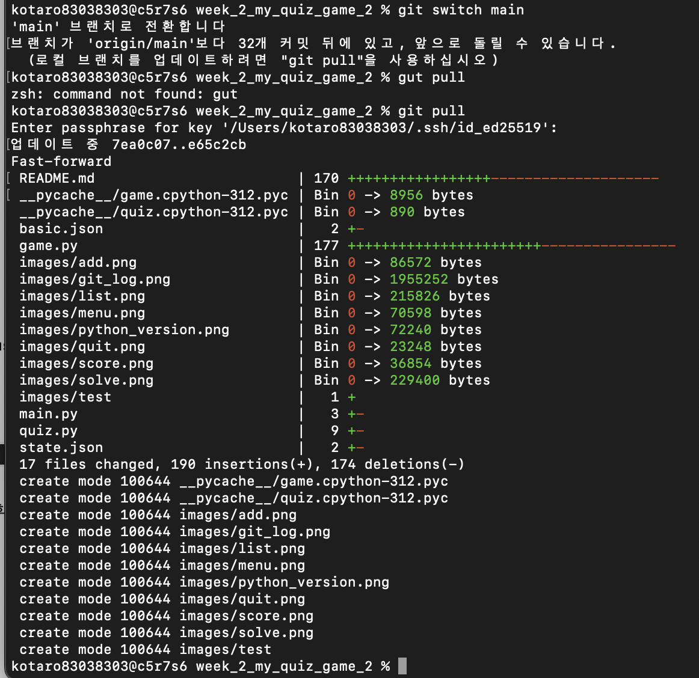

# 🧠 나만의 퀴즈 게임 (Python Console Quiz Game)

## 📌 프로젝트 개요

터미널에서 실행되는 Python 기반 퀴즈 게임입니다.
사용자는 퀴즈를 풀고, 새로운 퀴즈를 추가하며, 점수를 기록하고 확인할 수 있습니다.
데이터는 JSON 파일에 저장되어 프로그램 종료 후에도 유지됩니다.

---

## 🎯 퀴즈 주제 및 선정 이유

**주제: (예: 과학)**

선정 이유:
흥미를 유지하면서 학습할 수 있는 주제를 선택하였으며,
과학을 좋아했기 때문입니다.

---

## ▶ 실행 방법

```bash
python main.py
```

Python 3.10 이상 필요

---

## 🛠 기능 목록

### 1. 퀴즈 풀기

* 저장된 퀴즈를 순서대로 출제
* 정답 입력 및 결과 출력
* 최종 점수 계산

### 2. 퀴즈 추가

* 문제, 선택지 4개, 정답 입력
* 입력값 검증 처리
* 추가 후 자동 저장

### 3. 퀴즈 목록 보기

* 저장된 모든 퀴즈 출력
* 퀴즈 개수 확인 가능

### 4. 점수 확인

* 최고 점수 출력
* 퀴즈 플레이 시 자동 갱신

### 5. 종료

* 프로그램 종료 시 데이터 저장

---

## 📂 파일 구조

```
project/
│
├── main.py          # 프로그램 실행 파일
├── quiz.py          # Quiz 클래스 정의
├── game.py          # QuizGame 클래스 정의
├── state.json       # 데이터 저장 파일
├── basic.json       # 기본 퀴즈 데이터 (복구용)
├── README.md        # 프로젝트 설명
└── .gitignore
```

---

## 💾 데이터 파일 설명 (state.json)

### 📍 위치

프로젝트 루트 디렉토리

### 📍 역할

* 퀴즈 데이터 저장
* 최고 점수 저장

### 📍 구조 예시

```json
{
  "quizzes": [
    {
      "question": "Python의 창시자는?",
      "choices": ["Guido", "Linus", "Bjarne", "James"],
      "answer": 1
    }
  ],
  "best_score": 3
}
```

---

## ⚙️ 주요 기술

* Python (기초 문법, 클래스, 함수)
* JSON (데이터 저장)
* 파일 입출력
* 예외 처리 (try/except)
* Git / GitHub (버전 관리)

---

## 🔧 예외 처리

* 잘못된 입력 (문자, 범위 초과)
* 빈 입력 처리
* 파일 없음 → 기본 데이터 생성
* 파일 손상 → 초기화
* Ctrl+C / EOFError 안전 종료

---

## 🌿 Git 사용

* 기능 단위 커밋
* 브랜치 생성 및 병합
* 주요 명령어 사용:

  * init
  * add
  * commit
  * push
  * pull
  * checkout
  * clone

## 🚀 향후 개선 (선택 기능)

* 랜덤 문제 출제
* 문제 수 선택 기능
* 힌트 기능
* 퀴즈 삭제
* 점수 히스토리 저장

# 📝 나만의 퀴즈 게임 개발 체크리스트 (클래스/메서드별 구현 위치 포함)

---

## 1️⃣ Git 저장소 설정

* [x] GitHub에 새 저장소 생성
* [x] 로컬 저장소 초기화 (`git init`)
* [x] `.gitignore`, `README.md` 생성
* [x] 초기 커밋 및 push

---

## 2️⃣ 프로젝트 구조 설정

* [x] `main.py`: 프로그램 진입점, `Game` 객체 생성 후 메뉴 실행
* [x] `quiz.py`: `Quiz` 클래스 정의
* [x] `game.py`: `Game` 클래스 정의
* [x] `state.json`: 기본 퀴즈 데이터 + 최고 점수
* [x] 기본 퀴즈 데이터 5개 이상 생성

---

## 3️⃣ Quiz 클래스 구현 (`quiz.py`)

* [x] 속성

  * `question`: 문제 문자열
  * `choices`: 선택지 리스트 (4개)
  * `answer`: 정답 번호 (1~4)
* [x] 메서드

  * `__getitem__(key)`: 인스턴스["key"]로 값얻기
  * `__setitem__(key, value)`: 인스턴스["키"] = value로 값설정
* [x] Git 커밋: Quiz 클래스 작성

---

## 4️⃣ Game 클래스 구현 (`game.py`)

### 4-1. 속성

* [x] `quizzes`: Quiz 객체 리스트
* [x] `best_score`: 최고 점수

### 4-2. 파일 입출력 메서드

* [x] `load_state()`: `state.json` 읽기, 없으면 기본 데이터
* [x] `save_state()`: 현재 퀴즈와 최고 점수 저장

---

## 5️⃣ 공통 입력 및 예외 처리 (Game 클래스)

> 사용자 입력 처리와 오류 처리를 **Game 클래스** 내부 메서드에서 구현하면 모든 기능에서 재사용 가능

* [x] `get_user_input()`

  * 숫자 입력 시 공백 제거
  * 변환 실패 → 안내 메시지 후 재입력
  * 범위 밖 입력 → 안내 메시지 후 재입력
  * 빈 입력 처리 → 안내 메시지 후 재입력
  * Ctrl+C / EOFError → 안전 종료 후 저장
* [x] `safe_file_load()` / `safe_file_save()`

  * 파일 없음 → 기본 데이터 생성
  * 파일 손상 → 초기화 후 안내 메시지
* [x] Git 커밋: 공통 입력/예외 처리 구현

---

## 6️⃣ 메뉴 기능 (QuizGame 클래스)

* [x] `show_menu()` 메서드

  * 메뉴 출력:

    ```
    ========================================
    나만의 퀴즈 게임
    ========================================
    1. 퀴즈 풀기
    2. 퀴즈 추가
    3. 퀴즈 목록 보기
    4. 점수 확인
    5. 종료
    ========================================
    선택:
    ```
* [x] 사용자 입력 처리 → `get_user_input()` 사용 (1~5 숫자)
* [x] 메뉴 선택에 따라 해당 메서드 호출:

  * 1 → `play_quiz()`
  * 2 → `add_quiz()`
  * 3 → `show_quiz_list()`
  * 4 → `show_best_score()`
  * 5 → `exit_game()`
* [x] Git 커밋: 메뉴 구현

---

## 7️⃣ 퀴즈 풀기 기능 (`play_quiz()` in Game)

* [x] 저장된 퀴즈 순서대로 출제
* [x] 사용자 입력 → `get_user_input()` 사용
* [x] 모든 문제 완료 후 점수 계산
* [x] 최고 점수 갱신 시 안내 메시지
* [x] 퀴즈 없음 → 안내 메시지
* [x] Git 브랜치 생성 → 기능 구현 → main 브랜치 병합
* [x] Git 커밋: 퀴즈 풀기 기능

---

## 8️⃣ 퀴즈 추가 기능 (`add_quiz()` in Game)

* [x] 문제, 선택지 4개, 정답 번호 입력
* [x] 입력값 검증 → `get_user_input()` 사용
* [x] Quiz 객체 생성 후 리스트에 추가
* [x] 자동 저장 (`save_state()`)
* [x] Git 커밋: 퀴즈 추가 기능

---

## 9️⃣ 퀴즈 목록 보기 (`show_quiz_list()` in Game)

* [ ] 저장된 모든 퀴즈 출력

  * `[번호] 문제`
* [ ] 퀴즈 없음 → 안내 메시지
* [ ] Git 커밋: 목록 보기 기능

---

## 🔟 점수 확인 (`show_best_score()` in Game)

* [x] 최고 점수 출력
* [x] 퀴즈를 풀지 않은 경우 안내 메시지
* [x] Git 커밋: 점수 확인 기능

---

## 1️⃣1️⃣ 파일 입출력 (`load_state()` / `save_state()` in Game)

* [x] 퀴즈 데이터와 최고 점수 저장
* [x] JSON 읽기/쓰기 처리
* [x] 파일 없음/손상 시 기본 데이터 사용
* [x] Git 커밋: 파일 입출력 기능

---

## 1️⃣2️⃣ README.md 작성

* [x] 프로젝트 개요
* [x] 퀴즈 주제 및 선정 이유
* [x] 실행 방법
* [x] 기능 목록
* [x] 파일 구조
* [x] 데이터 파일 설명
* [x] Git 스크린샷/커밋 히스토리
* [x] Git 커밋: README 최종 작성

---

## 1️⃣3️⃣ Git 실습

* [ ] 저장소 clone
* [ ] README 수정 → commit → push
* [ ] 기존 로컬에서 pull 확인
* [ ] Git 커밋: clone & pull 실습 완료

---

## 1️⃣4️⃣ (선택) 보너스 기능

* [ ] 랜덤 문제 출제
* [ ] 문제 수 선택
* [ ] 힌트 기능
* [ ] 퀴즈 삭제
* [ ] 점수 기록 히스토리

---

## 1️⃣5️⃣ 제출 자료

* [ ] GitHub 저장소 URL
* [ ] 개발 환경 스크린샷 (VSCode, Python 버전, Git 설정)
* [ ] 프로그램 실행 결과 스크린샷 (퀴즈 추가, 목록, 플레이, 점수)
* [ ] `git log --oneline --graph` 결과 스크린샷

---

## screen shot

- menu
- solve
- add
- list
- score
- quit
- python --version
- git log --oneline --graph 결과 스크린샷
- git_clone
- git_pull


